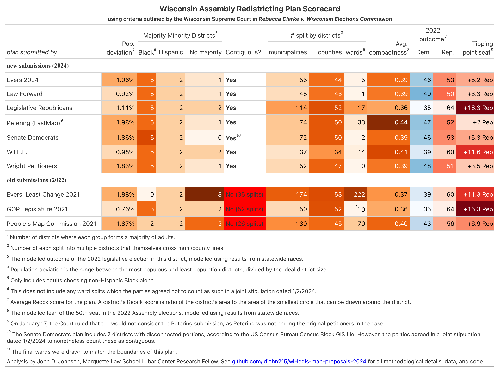
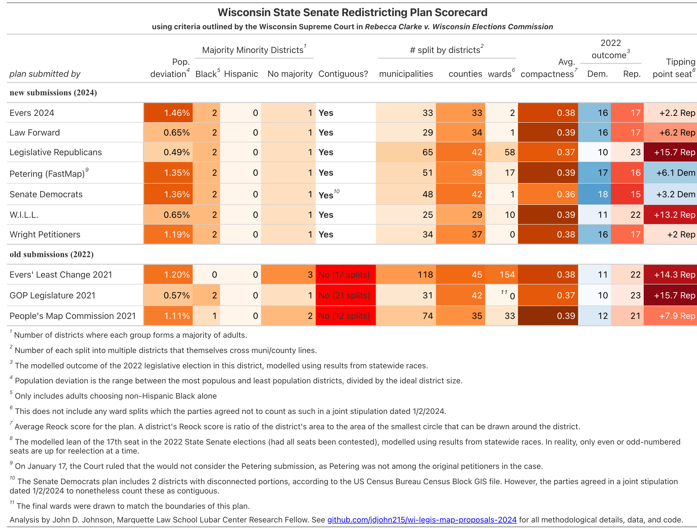

# Wisconsin Redistricting Scorecards

In December 2023, the Wisconsin Supreme Court threw out the existing state legislative maps and requested that parties to the case submit their own prospective maps. Should the political branches fail to agree on new maps, the Supreme Court will choose a new state map from among these submissions.

The Court listed several criteria.

* Population equality is essential for any map; although, the justices do quote a previous opinion that "[b]elow 1 percent, there are no legally or politically relevant degrees of perfection."
* Contiguity. This was the key legal issue settled in the latest court case. All districts must be composed of entirely contiguous areas.
* Per the Wisconsin Constitution, districts must be "in as compact form as practicable." Compactness is not defined.
* Federal Voting Rights Act standards must be met. We know the current breakdown of 5 majority Black and 2 majority Hispanic districts meet muster with the Supreme Court. Gov. Evers' least change plan was rejected by the court.
* Districts should avoid unnecessarily splitting counties and municipalities.
* The court "will consider partisan impact when evaluating remedial maps."

In this repository, I provide the data and code to operationalize and measure these criteria. The scorecards below contain summary statistics pertaining to each of the court's stated criteria. See `workflow.md` for more details.

*January 5th note. Since new plans are not due at the Supreme Court until January 12th, I have tested the following analysis on 3 of the plans previously considered for adoption.*

